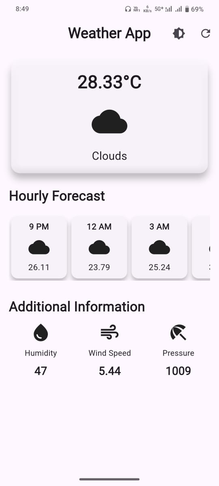
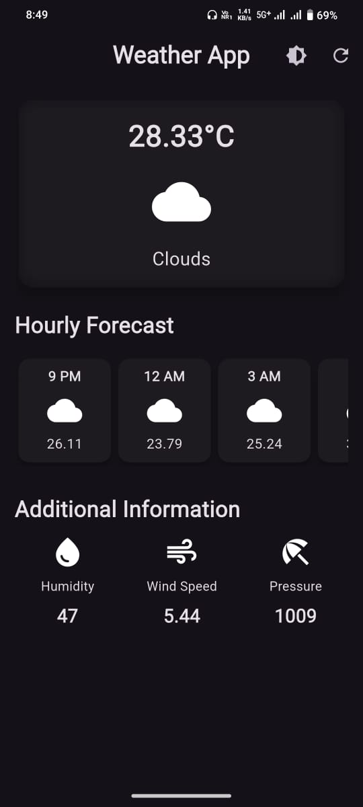

# weather_app

A Flutter-based weather forecasting app that provides real-time weather updates based on your **current location** using the **OpenWeatherMap API**.

## Features

- 🌍 Detects and uses current location for weather data
-  Sows temperature in Celsius
-  Displays sky conditions (Sunny, Rainy, Cloudy, etc.)
-  Hourly weather forecast
-  Additional info like Humidity, Wind Speed, and Pressure
-  Refresh button for manual updates
-  Light/Dark theme toggle

## Tech Stack

- **Flutter** (Dart)
- **OpenWeatherMap API**
- **Geolocator package** (for location services)
- **HTTP package** (for API calls)

## Screenshots<table>
  <tr>
    <td></td>
    <td></td>
  </tr>
</table>

## Getting Started

This project is a starting point for a Flutter application.

A few resources to get you started if this is your first Flutter project:

- [Lab: Write your first Flutter app](https://docs.flutter.dev/get-started/codelab)
- [Cookbook: Useful Flutter samples](https://docs.flutter.dev/cookbook)

For help getting started with Flutter development, view the
[online documentation](https://docs.flutter.dev/), which offers tutorials,
samples, guidance on mobile development, and a full API reference.
